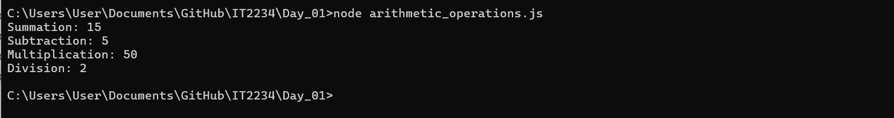
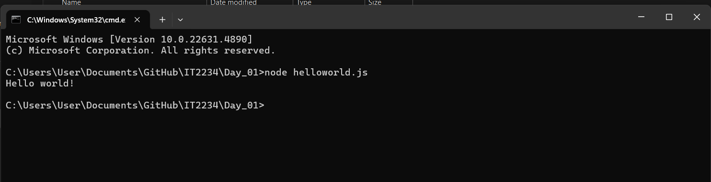
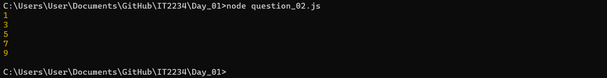
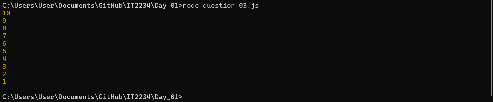
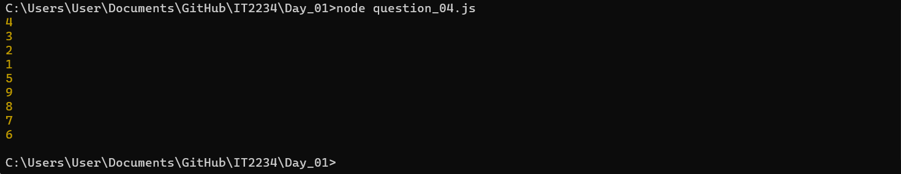

| Codes | Output |
|-------|--------|
|['arithmetic_operations.js'](./Codes/arithmetic_operations.js)||
|['helloworld.js'](./Codes/helloworld.js)||
|['question_01.js'](./Codes/question_01.js)||
|['question_02.js'](./Codes/question_02.js)||
|['question_03.js'](./Codes/question_03.js)||
|['question_04.js'](./Codes/question_04.js)||
