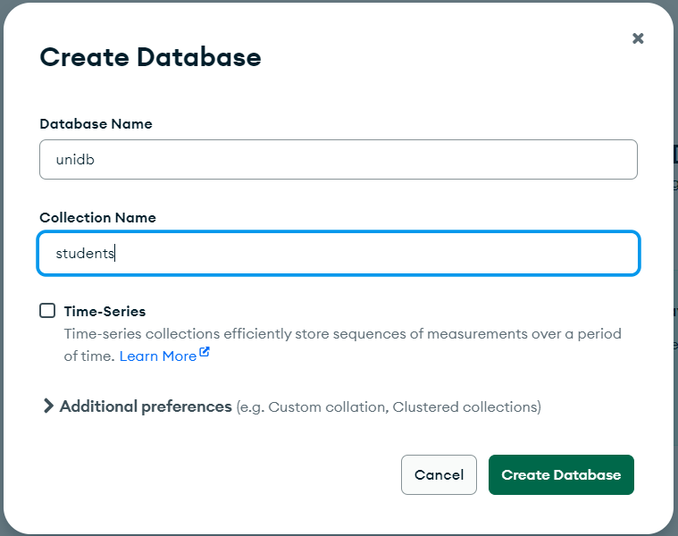
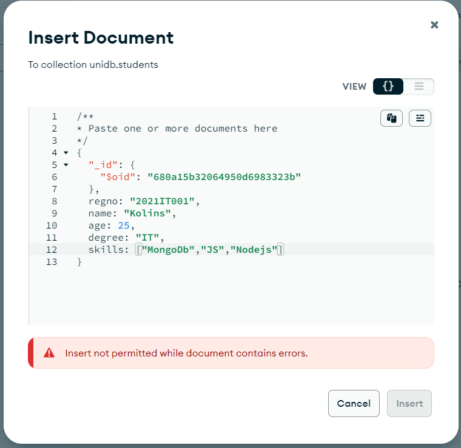
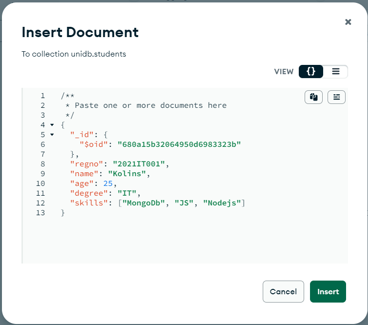
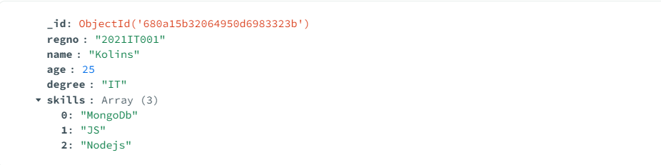
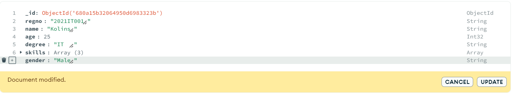
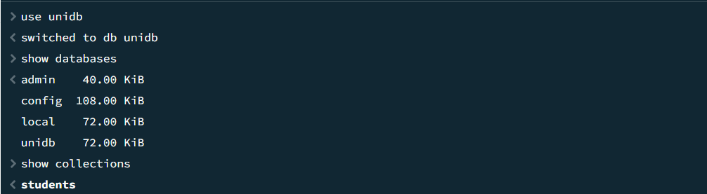
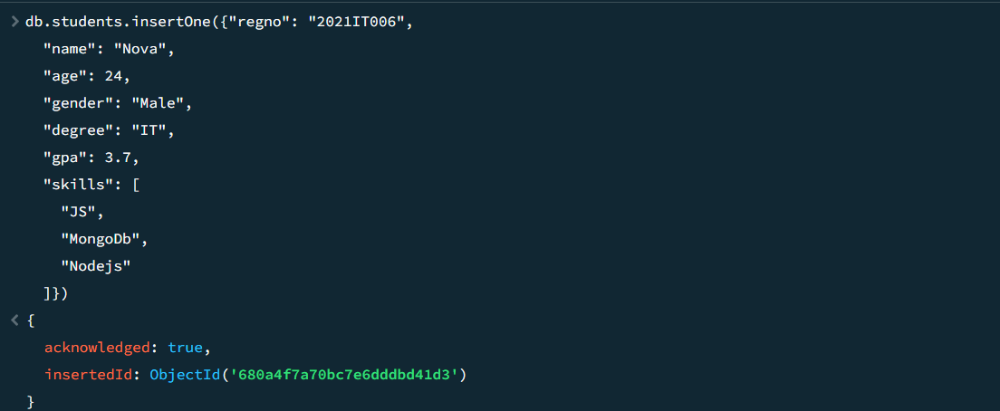
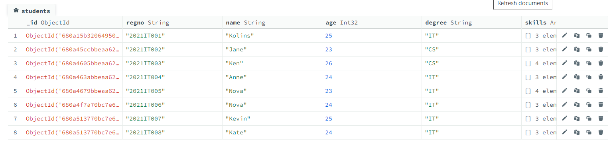

## 🍃 MongoDB Hands-On

📦 DB Creation | 📁 Collections | 🛠️ CRUD | 🔍 Queries

## Key Terms.

Database → Holds collections

Collection → Like a table (stores documents)

Document → BSON-style object

🄚 _id →  Auto-generated, unique identifier

## 🏗️ Create a Database & Collection Using Compass

Create Database -> Database Name -> Collection Name -> Create Database

## ✍️ Insert Documents Using Compass

Insert Document -> insert keys and values. 

>> Use format button to make the document permitted.

>> Inserted Document

## ✍️ Edit Documents Using Compass

Edit -> Make changes -> Update

## ✍️ Insert Documents Using MongoDB Shell

>> Change database and display available databases and collections.

>> Enter one document - insertOne()

~~~
  db.students.insertOne({
  "regno": "2021IT006",
  "name": "Nova",
  "age": 24,
  "gender": "Male",
  "degree": "IT",
  "skills": [
    "JS",
    "MongoDb",
    "Nodejs"
  ]
})
~~~

>> Inserted Documents.

>> Enter multiple documents - insertMany()

~~~
  db.students.insertMany(
[
{
  "regno": "2021IT007",
  "name": "Kevin",
  "age": 25,
  "gender": "Male",
  "degree": "IT",
  "skills": [
    "JS",
    "MongoDb",
    "MySQL"
  ]
},
{
  "regno": "2021IT008",
  "name": "Kate",
  "age": 24,
  "gender": "Female",
  "degree": "IT",
  "skills": [
    "JS",
    "MongoDb",
    "Nodejs"
  ]
}
]
)

~~~

>> Shell response.
~~~
  {
  acknowledged: true,
  insertedIds: {
    '0': ObjectId('680a513770bc7e6dddbd41d4'),
    '1': ObjectId('680a513770bc7e6dddbd41d5')
  }
}
~~~

>> Inserted Documents.

