## 🍃 MongoDB Hands-On

 DB Creation | Collections |  CRUD |  Queries

## Key Terms.

Database → Holds collections

Collection → Like a table (stores documents)

Document → BSON-style object

🄚 _id →  Auto-generated, unique identifier

## 🏗️ Create a Database & Collection Using Compass

Create Database -> Database Name -> Collection Name -> Create Database

## ✍️ Insert Documents Using Compass

Insert Document -> insert keys and values. 

Use format button to make the document permitted.

Inserted Document

## ✍️ Edit Documents Using Compass

Edit -> Make changes -> Update

## ✍️ Insert Documents Using MongoDB Shell

Change database and display available databases and collections.

Enter one document - insertOne()

~~~
  db.students.insertOne({
  "regno": "2021IT006",
  "name": "Nova",
  "age": 24,
  "gender": "Male",
  "degree": "IT",
  "skills": [
    "JS",
    "MongoDb",
    "Nodejs"
  ]
})
~~~

Inserted Documents.

Enter multiple documents - insertMany()

~~~
  db.students.insertMany(
[
{
  "regno": "2021IT007",
  "name": "Kevin",
  "age": 25,
  "gender": "Male",
  "degree": "IT",
  "skills": [
    "JS",
    "MongoDb",
    "MySQL"
  ]
},
{
  "regno": "2021IT008",
  "name": "Kate",
  "age": 24,
  "gender": "Female",
  "degree": "IT",
  "skills": [
    "JS",
    "MongoDb",
    "Nodejs"
  ]
}
]
)

~~~

Shell response.
~~~
  {
  acknowledged: true,
  insertedIds: {
    '0': ObjectId('680a513770bc7e6dddbd41d4'),
    '1': ObjectId('680a513770bc7e6dddbd41d5')
  }
}
~~~

Inserted Documents.

## 🛠️ Update Documents Using MongoDB Shell

Update one document - updateOne()

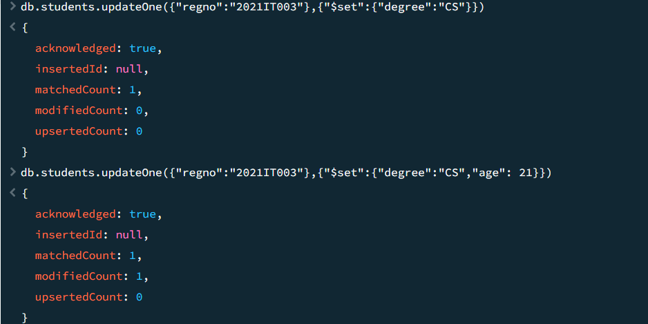

Updated Documents.

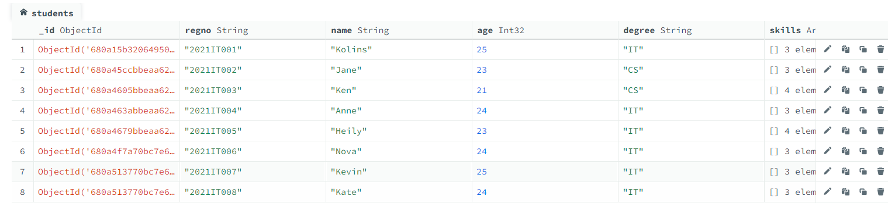

Update document - updateMany()

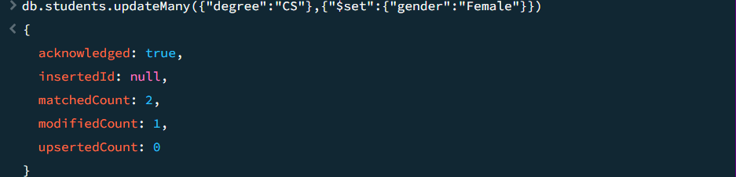

Updated Documents.

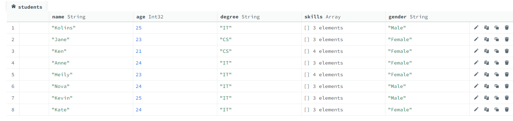

## 🧹 Delete Documents Using MongoDB Shell
~~~
 db.students.deleteOne({ regno: "2021IT006" })

 db.students.deleteMany({ degree: "IT" })
~~~
## 🧠 Query Operators
 * find() 
 * project
 * sort
 * $gt -> greater than
 * $lt -> less than
 * $eq -> equal
 * $ne -> not equal
 * $in -> matches any in array
 * $nin -> doesn't matches any in array

## 🔍 Find Data Using Compass

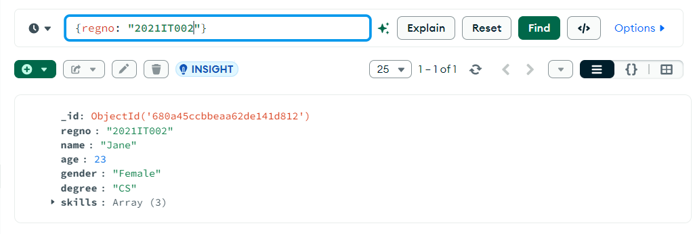

## 💡 Projecting Data Using Compass

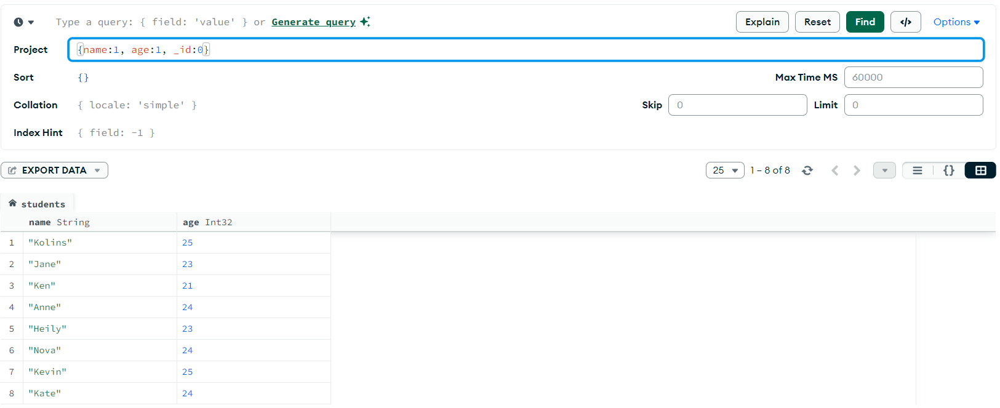

## 🔃 Sorting Data Using Compass

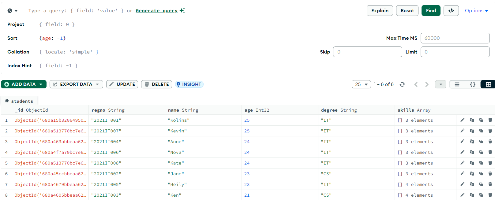

## 🔼 Greater Than -> $gt

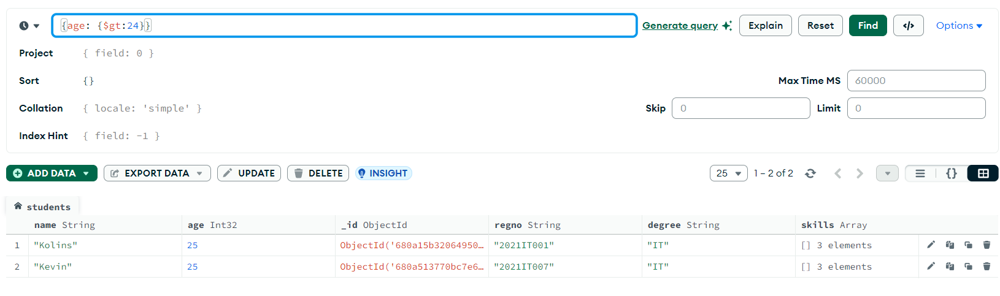

## 🔽 Less Than -> $lt

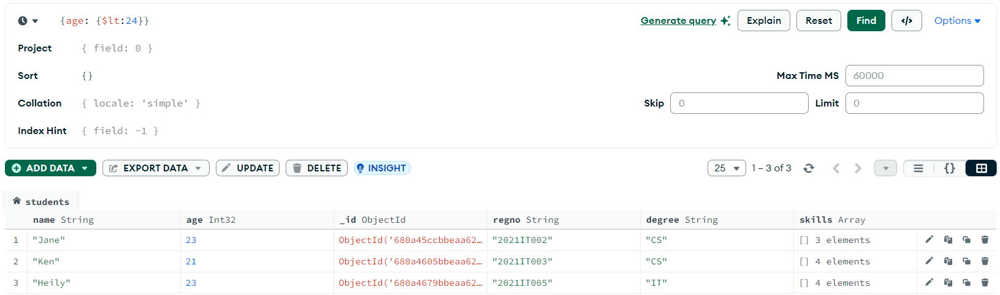

## 🟰 Equal -> $eq

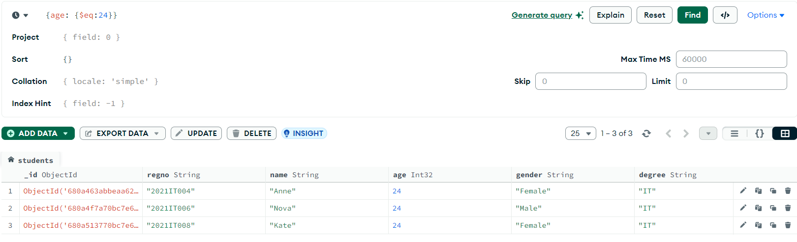

## ❌ Not Equal -> $ne

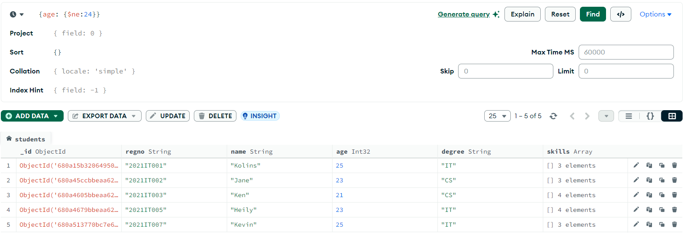

## 📥 Matches any in array -> $in

## 🚫📥 Doesn't matches any in array -> $nin

