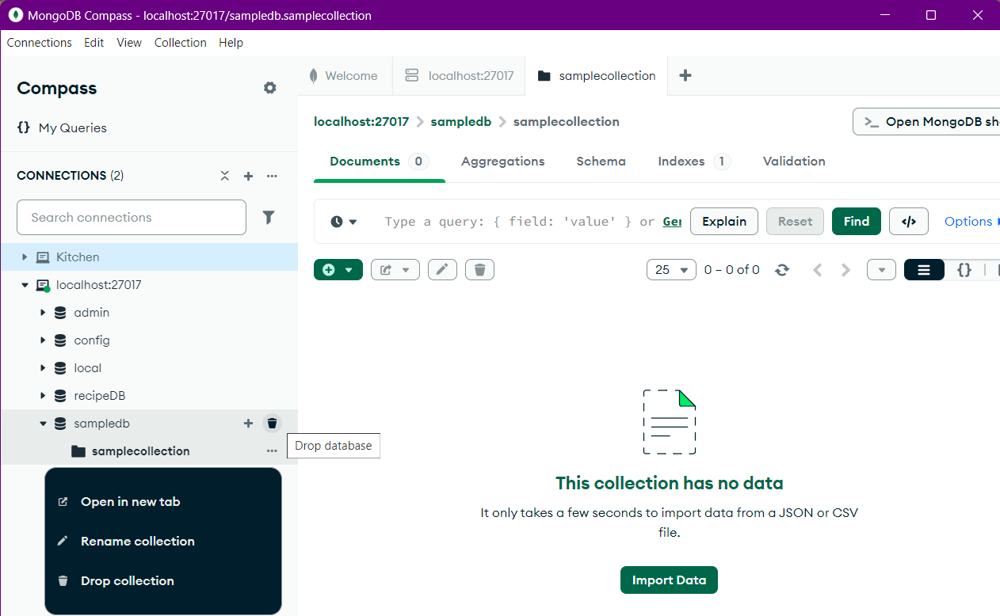
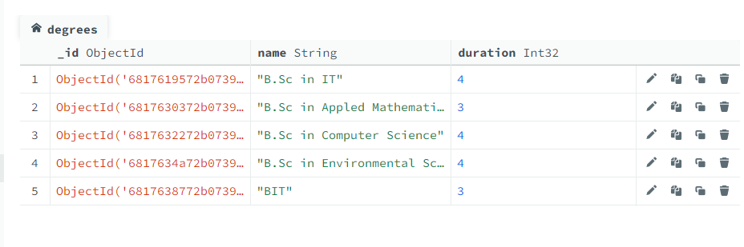
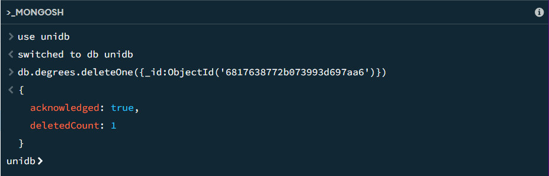
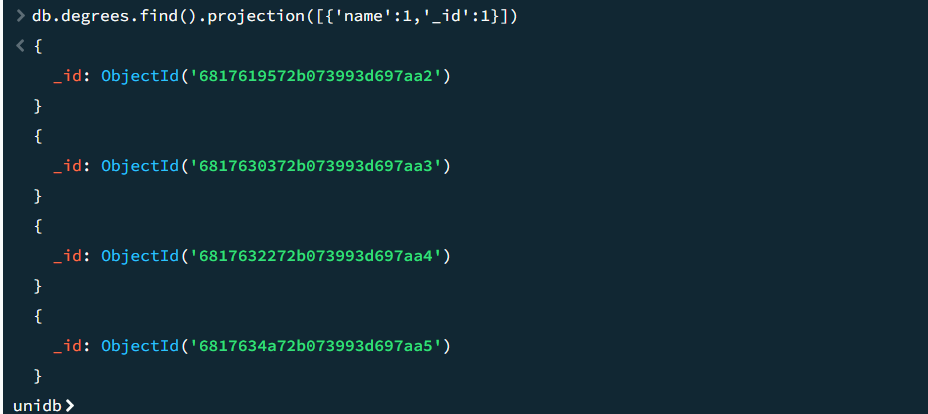
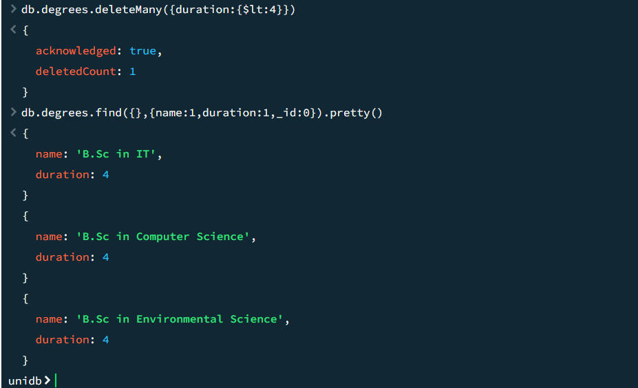
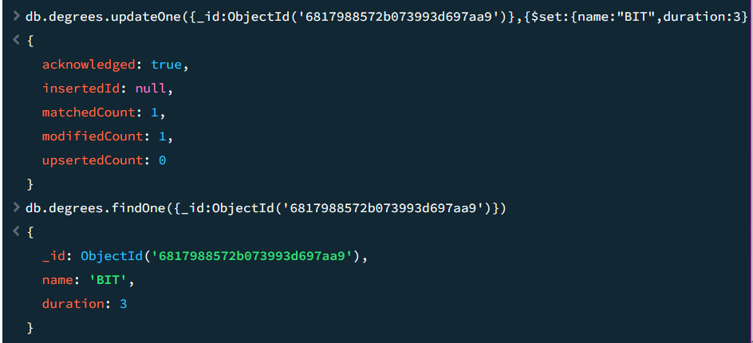
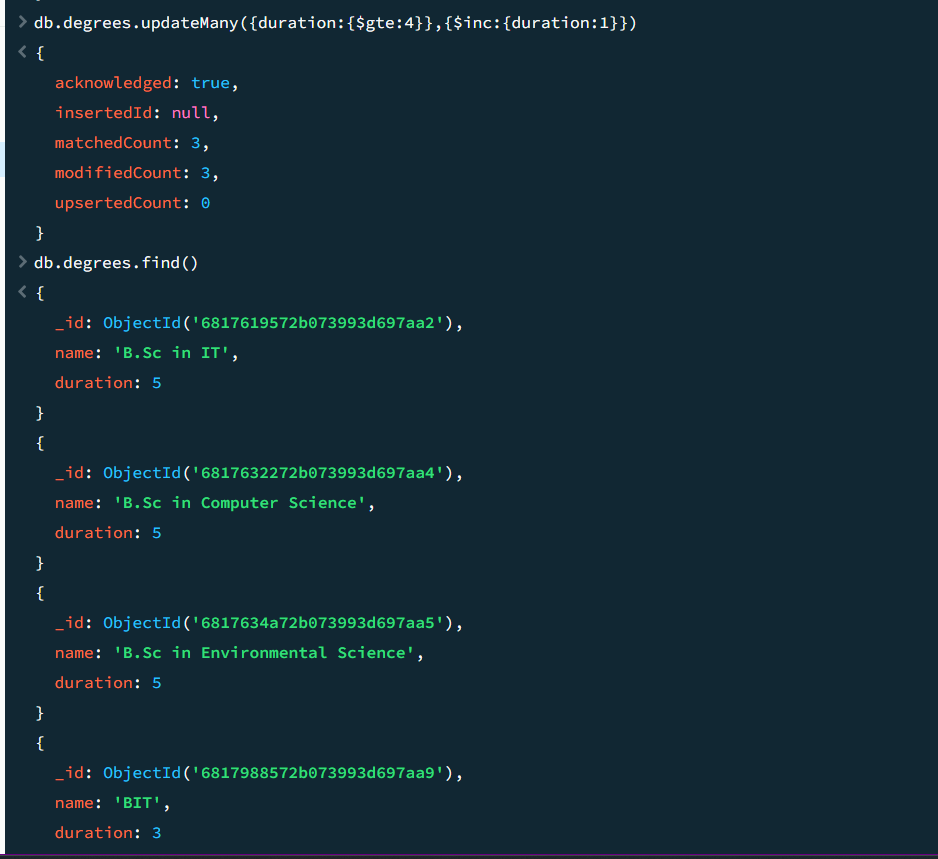

## 🍃 MongoDB Hands-On

 DB Creation | Collections |  CRUD |  Queries

## 🧹 Delete Documents Using MongoDB Compass

## 🧹 Delete Documents Using MongoDB Shell

Delete one document - deleteOne()

Shell response.

Delete Documents - deleteMany()

## 🛠️ Update Documents Using MongoDB Shell

Update one document - updateOne()

Update document - updateMany()

