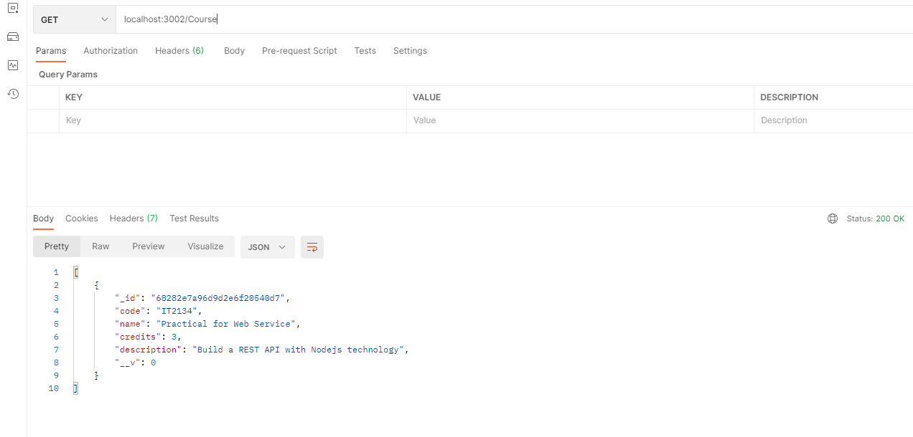
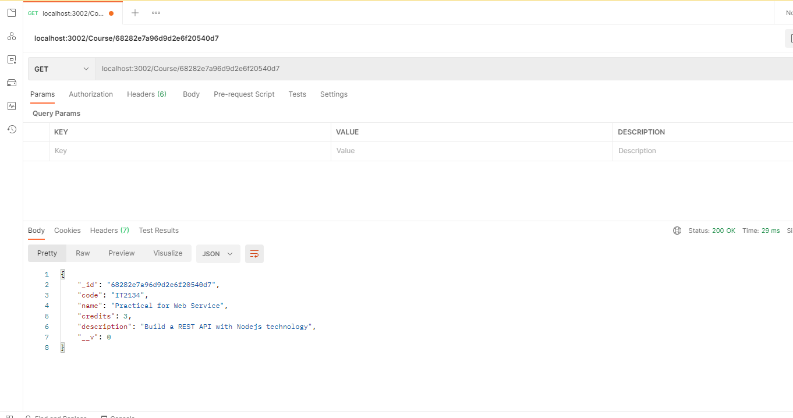
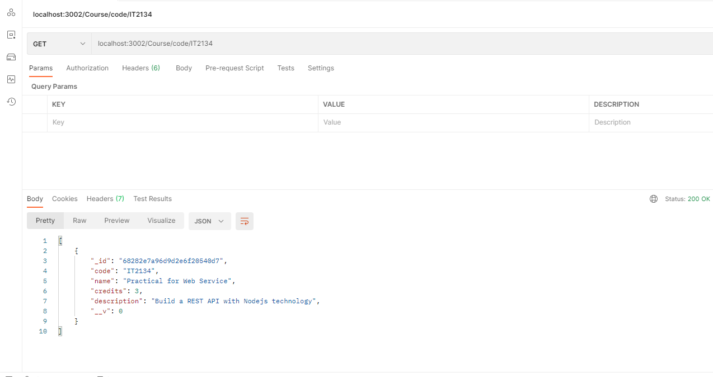
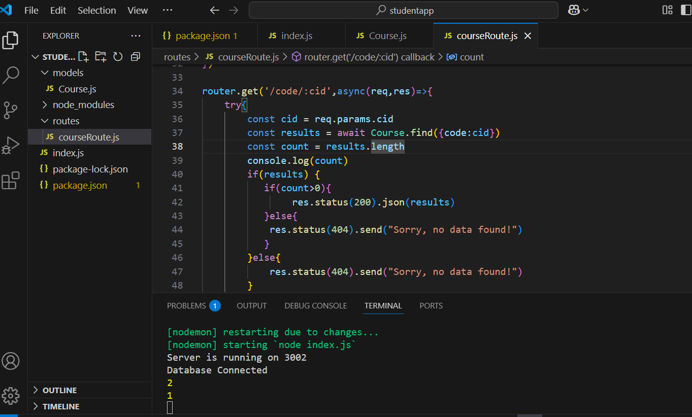

## Student App

['StudentApp'](./Codes/studentapp.zip)

* Insert 

```
router.post('/',async(req,res)=>{
    try{
        const {code,name,credits,description} = req.body
        if(!code || !name || !credits) {
            res.status(400).send("Please provide data to the required fileds!")
        }else{
            const results = await Course.create({code,name,credits,description})
            res.status(200).json(results)
        }
    }catch(error){
        console.error(error);
        res.status(500).send("Server Error!")
    }
})
```




* Update
  
```
router.put('/:id',async(req,res)=>{
    try{
        const id = req.params.id
        if(!mongoose.Types.ObjectId.isValid(id)){
            return res.status(400).send("Invalid ID!")
        }
        const ucourse = await Course.findById(id)
        const {code,name,credits,description} = req.body
        if(!code || !name || !credits) {
            res.status(400).send("Please provide data to the required fileds!")
        }else{
            const results = await ucourse.updateOne({code,name,credits,description})
            res.status(200).json(results)
        }
    }catch(error){
        console.error(error);
        res.status(500).send("Server Error!")
    }
})
```



* Delete

```
router.delete('/:id',async(req,res)=>{
    try{
        const id = req.params.id
        if(!mongoose.Types.ObjectId.isValid(id)){
            return res.status(400).send("Invalid ID!")
        }
        const dcourse = await Course.findById(id)
        const results = await dcourse.deleteOne(dcourse).catch((error)=>{
            return res.status(500).json(error)}
        )
        res.status(200).json(results)
    }catch(error){
        console.error(error);
        res.status(500).send("Server Error!")
    }
})
```


