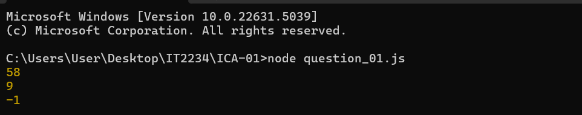
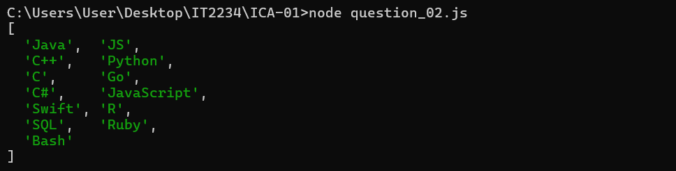
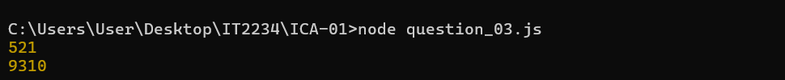
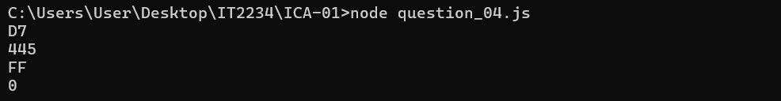

| Codes | Output |
|-------|--------|
|['question-01.js'](./Code/question-01.js)||
|['question-02.js'](./Code/question-02.js)||
|['question-03.js'](./Code/question-03.js)||
|['question-04.js'](./Code/question-04.js)||
